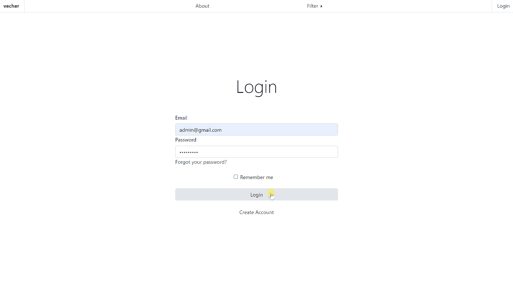

# OnlineShop

The app is based on the **ASP.NET Core** framework and consists of two parts: a web application
and a database. Both parts communicate using Entity Framework **(EF)** Core. All classes and dependencies are supported by Dependency Injection **(DI)**. 

All the images have been taken from the Instagram of Valerie Chernysheva:
[https://www.instagram.com/vecher.ceramics/](https://www.instagram.com/vecher.ceramics/)

### The main page, Filter, and Product  Card

### Registration, Authorisation and Admin Pannel

### Database

All objects are stored in **Microsoft SQL Server 2019**. The database has two contexts: DataBase and Identity. The first one allocates objects related to Products and Orders. The second one is responsible for Authorisation and Registration, which is managed with the **ASP.NET Identity**.

### WebApp

The web app is based on Model-View-Controller **(MVC)** pattern. Models between the database and view are mapped manually. All views use **Bootstrap**. The app is separated into three areas: Admin, User, and Brand. 

### Users

Admin has the rights to:
- add/delete/modify products (manipulation of product image still in process);
- see all orders and update an order status;
- delete/change email, password, or rights of a user;
- manage roles; 

User has the rights to:
- save products to favorite list;
- put items on the card and make an order;
- unregistered user cannot purchase any product (has to be solved)

To test each of the user areas please use the following data: 

Admin E-mail = "admin@gmail.com";
Admin Password = "_Aa123456";

Test User E-mail = "artemgilmanov@gmail.com";
Test User Password = "_qWer12356";

### Debugging

To ease the debugging process, the **Serilog** package was used. 

### Packages

1. Microsoft.EntityFrameworkCore (5.0.7)
2. Microsoft.EntityFrameworkCore.SqlServer (5.0.7.)
3. Microsoft.EntityFrameworkCore.Tools (5.0.7.)
4. Microsoft.AspNetCore.Identity.EntetyFrameworkCore (5.0.7)
5. Bootstrap (4.3.1)
6. Microsoft.EntityFrameworkCore.Design (5.0.7.) - to manage migrations.
7. Serilog (2.12.1-dev-01587)
8. Serilog.AspNetCore (6.1.0-dev-00285)
9. Serilog.Enrichers.Environment (2.2.1-dev-00787)
10. Serilog.Enrichers.Process (2.0.2)
11. Serilog.Enrichers.Thread (3.2.0-dev-00752)
12. Serilog.Settings.Configuration (3.5.0-dev-00359)